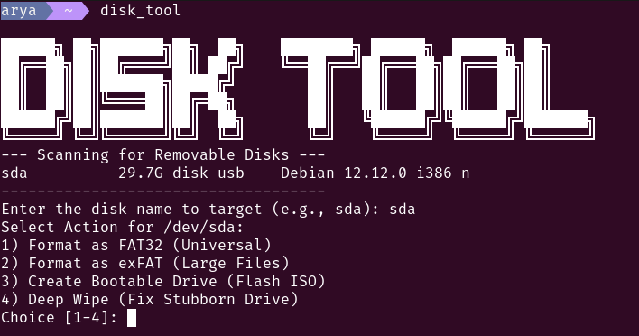

# Disk_Tool


Disk_Tool is a professional, interactive CLI utility for Linux systems designed to streamline the management of USB drives and SD cards. It provides a safe, menu-driven interface for partitioning, formatting, and flashing ISO images, replacing complex and potentially dangerous manual terminal commands.

## Features

- **Hardware Identification:** Automatically scans for and displays only removable USB block devices using `lsblk`.
- **Multiple Formats:** Support for creating FAT32 (universal compatibility) or exFAT (large file support) partitions.
- **Custom Labels:** Prompts the user for a volume name during the formatting process.
- **ISO Flasher:** A safe wrapper for the `dd` command to create bootable media with integrated progress tracking.
- **Deep Wipe:** Logic to strip filesystem signatures and zero out the first 100MB of a drive to fix read-only or unresponsive hardware.
- **Safety Confirmation:** Mandatory user confirmation gate to prevent accidental data loss on system drives.
- **ASCII UI:** Includes a custom ANSI Shadow ASCII banner for a polished terminal experience.

---

## Installation

To set up Disk_Tool as a global command on your system, follow these steps:

### 1. Clone the Repository

```bash
git clone https://github.com/Arya-S-Patil/disk_tool.git
cd disk_tool
```

### 2. Set Permissions

Make the script executable so it can be run by the system:

```bash
chmod +x disk_tool.sh
```

### 3. Move to Local Bin

Relocate the script to your local binary folder and rename it for a cleaner command experience:

```bash
mkdir -p ~/.local/bin
mv disk_tool.sh ~/.local/bin/disk_tool
```
Note you can have your own short command instead of disk_tool by just changing here ~/.local/bin/(New name)

### 4. Update Your PATH

Ensure your shell knows where to find the tool by adding this line to your `~/.bashrc` or `~/.zshrc`:

```bash
export PATH="$HOME/.local/bin:$PATH"
```

Run the following to apply the changes immediately:

```bash
source ~/.bashrc
```

---

## Usage

Once installed, you can launch the tool from any directory by typing:

```bash
disk_tool
```

Follow the on-screen prompts to select your target disk and desired action.

---

## Requirements

This tool relies on standard Linux utilities. Ensure the following are installed:

- **parted:** For partition table management.
- **util-linux:** Provides `lsblk` and `wipefs`.
- **dosfstools:** Provides `mkfs.vfat`.
- **exfatprogs:** For `mkfs.exfat` support.

---

## License

Distributed under the MIT License. See LICENSE for details.

---

**Developed by Arya Sadanand Patil**
